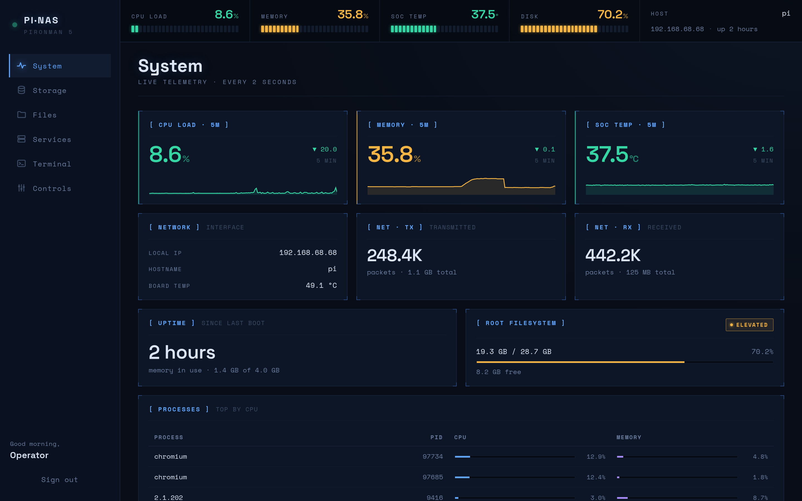
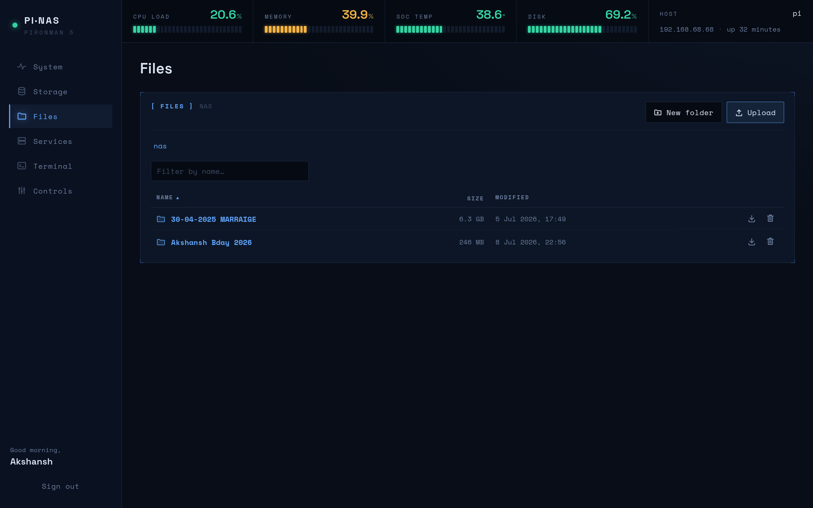

<div align="center">

# PiNAS

**A self-hosted dashboard + NAS for a Raspberry Pi 5 in a Pironman 5 case.**

Live telemetry, RAID & Samba, a photo-viewing file explorer, an in-browser
terminal, and case controls — one clean instrument-panel UI.

<br />

[](https://www.raspberrypi.com/products/raspberry-pi-5/)
[](https://fastapi.tiangolo.com/)
[](https://react.dev/)
[](https://vitejs.dev/)
[](https://tailscale.com/)

<br />



</div>

---

## Why?

A Raspberry Pi in a Pironman case is a lovely little machine. Off-the-shelf
tools for looking after it usually mean stitching together Grafana + Cockpit +
Samba GUI + a file browser + SSH terminal. **PiNAS is that stitch**, purpose-built
for one operator on one Pi, with a single install script and a single web UI.

Everything runs on the Pi. Nothing phones home.

## What's inside

<table>
<tr>
<td width="33%" valign="top">

### 📊 System

CPU, RAM, temperature, disk, network and processes — streamed live over SSE,
sampled every 2 seconds, with 5-minute sparklines.

</td>
<td width="33%" valign="top">

### 💾 Storage

Create / assemble / mount / repair **mdadm RAID** arrays. Add and manage
**Samba** shares and users. Read **SMART** health per drive.

</td>
<td width="33%" valign="top">

### 📁 Files

Browse the NAS. Upload, and download files *or whole folders as a streamed
`.zip`*. Preview photos, video, audio, and text — with a keyboard-driven media
viewer. Even HEIC.

</td>
</tr>
<tr>
<td width="33%" valign="top">

### ⚙️ Services

Start / stop / restart your systemd units with live `journalctl` tailing.
Tailscale panel shows tailnet status, devices, and copy-ready remote URLs.

</td>
<td width="33%" valign="top">

### 🖥️ Terminal

A real bash login shell in the browser — [xterm.js](https://xtermjs.org) over
a WebSocket-backed PTY, running as your Linux user with the same permissions
as SSH.

</td>
<td width="33%" valign="top">

### 🎛️ Controls

Reboot / shutdown. Check *and apply* apt updates from the UI. Pironman
RGB / OLED / case-fan settings. CPU fan on/off. Everything in one panel.

</td>
</tr>
</table>

## Files, up close



<sub>Recursive folder sizes, folder-first sorting, streamed `.zip` downloads,
inline previews (photos, video, audio, text — including HEIC), and a
keyboard-driven media viewer with slideshow.</sub>

## Quick start

On a fresh Raspberry Pi OS install, one line does everything:

```bash
curl -fsSL https://raw.githubusercontent.com/akshanshkmr/PiNAS/main/install.sh | bash
```

That installs `git`, clones the repo into `~/PiNAS`, and hands off to
`setup.sh` — which installs Node, `uv`, Apache, Samba, mdadm, smartmontools,
Pironman, and Tailscale, builds the frontend, and starts the `dashboard`
service. When it finishes, open **http://pi.local/** and sign in with your
Linux account.

> The installer is **idempotent** — re-run the same one-liner to update.
> Hardware-specific steps (Pironman case, CPU fan) never abort the run: they
> warn and continue, so you can point it at a Pi 4 or a case-less Pi 5 and
> everything except the case controls still works.

### Optional flags

Both `install.sh` and `setup.sh` read these; pass them via the environment on
the same line:

```bash
# add a NOPASSWD sudoers rule for the current user if they don't have one
curl -fsSL https://.../install.sh | SETUP_ENABLE_NOPASSWD_SUDO=1 bash

# also run a full apt upgrade (slow; off by default)
curl -fsSL https://.../install.sh | SETUP_FULL_UPGRADE=1 bash

# clone to a different location
curl -fsSL https://.../install.sh | PINAS_DIR=/opt/pinas bash
```

### Manual clone (if you'd rather see the code first)

```bash
sudo apt update && sudo apt install -y git
git clone https://github.com/akshanshkmr/PiNAS.git
cd PiNAS
./setup.sh
```

## Keyboard shortcuts (media viewer)

The Files preview is designed to be flown with the keyboard:

| Key       | Action                         |
| :-------- | :----------------------------- |
| **← →**   | Previous / next photo or video |
| **Space** | Play / pause video and audio   |
| **↑ ↓**   | Volume (persists across clips) |
| **F**     | Toggle fullscreen              |
| **Esc**   | Exit fullscreen, then close    |

There's also a **▶ Slideshow** mode — images and audio auto-advance every 4 s
with a progress bar; videos play through and advance when they end.

## Remote access

The **Services** tab shows your tailnet status, connected devices, and
ready-to-copy URLs:

| Kind          | URL                                            |
| :------------ | :--------------------------------------------- |
| Dashboard     | `https://<node>.<tailnet>.ts.net/`             |
| NAS (SMB)     | `smb://<node>.<tailnet>.ts.net/<share>`        |
| LAN dashboard | `http://pi.local/`                             |

Setting up Tailscale (once, interactively):

```bash
sudo tailscale up --ssh --advertise-routes=192.168.1.0/24
sudo tailscale serve --bg http://localhost:80
```

## Security notes

- **Auth is PAM.** Sign in with your Linux user + password. The service
  account needs passwordless sudo (default on Raspberry Pi OS) for
  RAID / Samba / power / systemctl / SMART / Terminal actions.
- **Terminal = SSH-equivalent.** Anyone who can sign in gets a login shell
  with your privileges. **Do not expose PiNAS to the public internet.** LAN
  and tailnet only.
- **Files API is sandboxed.** Requests are confined to your Samba share paths,
  mounted array mountpoints, and `/mnt/nas`; every path is `realpath`-checked
  so `..` and symlink escapes are rejected.

## Under the hood

<table>
<tr>
<td width="50%" valign="top">

**Managed services**

| Service     | What it does                              |
| :---------- | :---------------------------------------- |
| `dashboard` | FastAPI backend + SPA on `127.0.0.1:8501` |
| `fan`       | CPU fan on at boot (one-shot)             |
| `apache2`   | Reverse proxy on port 80                  |

Manage them from the **Services** tab, or with
`journalctl -u dashboard -f`.

</td>
<td width="50%" valign="top">

**Project layout**

```text
setup.sh          ← installs & updates everything
apache2/          ← reverse-proxy config
dashboard/
  backend/        ← FastAPI + PAM auth
  frontend/       ← React + Vite SPA
docs/             ← screenshots and design notes
```

</td>
</tr>
</table>

## Development

```bash
# backend — serves API + built frontend on :8501
cd dashboard/backend
uv run uvicorn app.main:app --reload --port 8501

# frontend — hot-reload dev server, proxies API calls to :8501
cd dashboard/frontend
npm install
npm run dev
```

## Troubleshooting

<details>
<summary><b>SSH host-key warning after reflashing</b></summary>

Run on **your** computer (not on the Pi):

```bash
ssh-keygen -R pi.local
```
</details>

<details>
<summary><b>Can't find the Pi's IP</b></summary>

Use `ping pi.local`, or if you have a TP-Link Deco network, open the Deco app
and look under **Network → Devices** for a host named `pi`.
</details>

<details>
<summary><b>Some dashboard actions return "sudo: a password is required"</b></summary>

Your account doesn't have passwordless sudo. Re-run the installer with:

```bash
SETUP_ENABLE_NOPASSWD_SUDO=1 ./setup.sh
```

This adds a `visudo`-validated `NOPASSWD` rule for your user.
</details>

<details>
<summary><b>The Pironman case controls don't work</b></summary>

The setup script skips the Pironman install if it fails, so a non-Pironman Pi
finishes cleanly — but that means the `pironman5` service isn't running. If
you *do* have the case, check `journalctl -u pironman5` and confirm the
[upstream project](https://github.com/sunfounder/pironman5) still supports
your branch.
</details>

## License

MIT.
